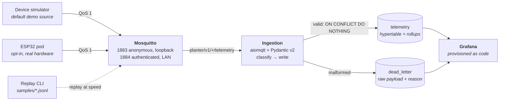

# Architecture

A five-minute tour of how a sensor reading becomes a dashboard panel, and why
each piece was chosen. The deep dives live in their own docs — this page
links rather than repeats.

Everything above runs from one `docker compose up`. The simulator is the
default producer; real hardware is an optional second producer that changes
nothing downstream.

## The components, and why

**Mosquitto** as the broker. Industry standard, a few megabytes, and zero
configuration to get a working pub/sub bus — the interesting engineering in
this repo is downstream of the broker, so the broker should be boring. It
runs with `persistence false` on purpose: it is a transient transport, and
durable state belongs in the database.

**Python 3.12 with `aiomqtt` and Pydantic v2** for ingestion. An async
consumer is the natural shape for a fan-in of many low-rate devices, and
Pydantic makes the message contract *typed and versioned* rather than
documented-and-hoped-for: one model, imported by producer and consumer alike,
is the single definition of what a reading is. See
[message-contract.md](message-contract.md) and
[ingestion.md](ingestion.md).

**TimescaleDB** for storage — the choice that makes the database a showcase
instead of a sink. Hypertables give time-series partitioning, continuous
aggregates give cheap hourly and daily rollups, and `ON CONFLICT` gives
idempotency, all in plain SQL: no new query language to learn, and every
query in the dashboard is reviewable text. See [storage.md](storage.md).

**Alembic with raw-SQL migrations**, run by a one-shot `migrate` service that
gates ingestion and Grafana via `service_completed_successfully`. The
requirement it satisfies is CI's: an empty database must migrate cleanly on
every run, so the schema is never something that only exists on a laptop.

**Grafana, fully provisioned as code.** Datasource and dashboards are JSON
and YAML in the repo, so a fresh clone produces the identical dashboard with
zero manual clicks — and every panel's SQL is mirrored in
[dashboard-queries.md](dashboard-queries.md), which a test enforces, so the
queries stay reviewable outside the dashboard JSON.

**Docker Compose** for orchestration, treated as a first-class engineering
requirement rather than a convenience: the promise is that a stranger clones
the repo and has a live dashboard in five minutes, and that promise is
smoke-tested in CI on every push.

## Idempotency, end to end

The pipeline is at-least-once on the wire and effectively-once in the
database, and that combination is what makes everything else safe:

1. Devices and the simulator publish at **QoS 1**, so the broker redelivers
   until it is acknowledged — no silent loss in transit.
2. The consumer holds a **persistent session**, so messages queue for it
   while it restarts rather than disappearing.
3. Every reading has a natural key, `(device_id, measured_at)`, and the write
   is `INSERT … ON CONFLICT DO NOTHING`. Redelivery, replay, and
   firmware-side resends all collapse to the same row.

Exactly-once is manufactured at the database, not demanded of the network.
The consequences are the interesting part: a captured window can be
**replayed** through the broker at speed and changes nothing the second time
(CI asserts an unchanged checksum after a second replay), and firmware that
loses a PUBACK can resend on the next wake without a second thought. The
honest boundaries — the ack window, broker restarts — are stated in
[ingestion.md](ingestion.md#delivery-semantics-effectively-once-honestly).

## Data quality is visible, not silent

Malformed input is a first-class outcome, not an exception. `classify()`
sorts each message into *valid reading* or *dead letter with a reason*, and
dead letters land in their own table with the raw bytes preserved. Nothing
crashes; nothing is dropped without a trace.

The dashboard then reports on the pipeline itself: dead-letter count and
rate, deduplicated messages, out-of-order arrivals, and missed check-ins
against the expected deep-sleep cadence. Those panels exist because during
firmware bring-up the data *about* the data is the thing you actually need.

## Demo and hardware: one pipeline, two producers

Demo mode keeps the anonymous, loopback-bound broker untouched. Hardware mode
is a compose override that adds a second, password-and-ACL-protected listener
on LAN port 1884 to the same broker — so real pods and the simulator feed one
identical pipeline with zero application-code changes.

That split exists because the two modes have genuinely different threat
models, not because hardware needs different plumbing: anonymous access is
fine for a broker only reachable from localhost, and unacceptable for one
reachable from the LAN. Keeping them as two listeners on one broker means the
default quickstart never grows a credentials step, and the hardware path
never becomes a fork of the stack. See
[hardware-bridge.md](hardware-bridge.md).

## Where to go deeper

- [message-contract.md](message-contract.md) — the wire format, topic tree, and versioning policy
- [ingestion.md](ingestion.md) — layering, delivery semantics, failure behavior
- [storage.md](storage.md) — hypertable, continuous aggregates, migrations
- [dashboard-queries.md](dashboard-queries.md) — every panel's SQL, with rationale
- [hardware-bridge.md](hardware-bridge.md) — pointing a real ESP32 pod at the stack
